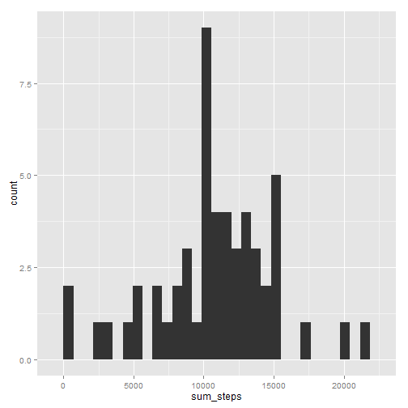
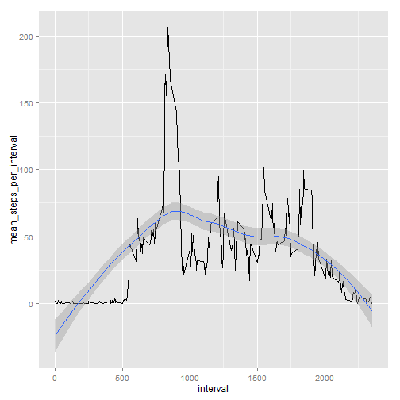
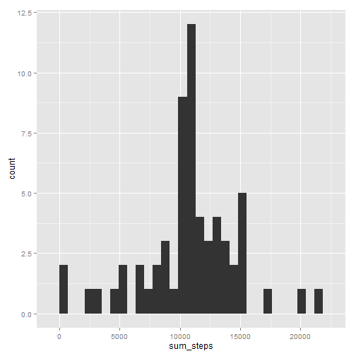
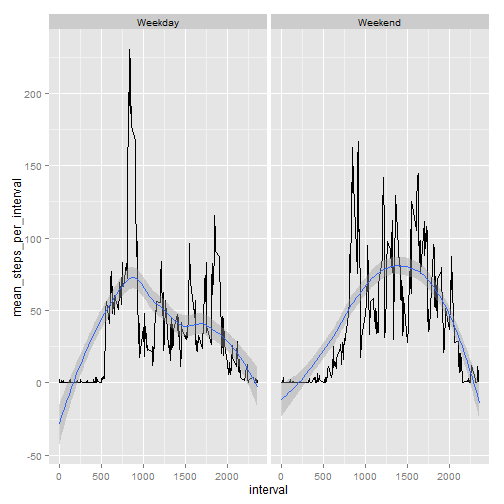

## Loading and preprocessing the data

Start by loading and preprocessing already downloaded and unpacked csv file into data table


```r
library(data.table)
setwd("\\\\nash/mtec-home/vdenis/My Documents/coursera")
data <- fread("activity.csv")
summary(data)
```

```
##      steps            date              interval     
##  Min.   :  0.00   Length:17568       Min.   :   0.0  
##  1st Qu.:  0.00   Class :character   1st Qu.: 588.8  
##  Median :  0.00   Mode  :character   Median :1177.5  
##  Mean   : 37.38                      Mean   :1177.5  
##  3rd Qu.: 12.00                      3rd Qu.:1766.2  
##  Max.   :806.00                      Max.   :2355.0  
##  NA's   :2304
```

Further prepare data: Convert date into proper date format


```r
data[,date := as.Date(date)]
```

```
##        steps       date interval
##     1:    NA 2012-10-01        0
##     2:    NA 2012-10-01        5
##     3:    NA 2012-10-01       10
##     4:    NA 2012-10-01       15
##     5:    NA 2012-10-01       20
##    ---                          
## 17564:    NA 2012-11-30     2335
## 17565:    NA 2012-11-30     2340
## 17566:    NA 2012-11-30     2345
## 17567:    NA 2012-11-30     2350
## 17568:    NA 2012-11-30     2355
```

## What is mean total number of steps taken per day?

1.1 Calculate the total number of steps taken per day


```r
total_steps <- data[,sum(steps), by = date]
setnames(total_steps, "V1", "sum_steps")
head(total_steps, 10)
```

```
##           date sum_steps
##  1: 2012-10-01        NA
##  2: 2012-10-02       126
##  3: 2012-10-03     11352
##  4: 2012-10-04     12116
##  5: 2012-10-05     13294
##  6: 2012-10-06     15420
##  7: 2012-10-07     11015
##  8: 2012-10-08        NA
##  9: 2012-10-09     12811
## 10: 2012-10-10      9900
```

1.2 If you do not understand the difference between a histogram and a barplot, research the difference between them. Make a histogram of the total number of steps taken each day


```r
library(ggplot2)
qplot(sum_steps, data = total_steps, geom = "histogram")
```

 

1.3 Calculate and report the mean and median of the total number of steps taken per day


```r
mm_steps <- total_steps[,list(mean(sum_steps, na.rm = TRUE),median(sum_steps, na.rm = TRUE))]
setnames(mm_steps, "V1", "mean_steps_per_day")
setnames(mm_steps, "V2", "median_steps_per_day")
mm_steps
```

```
##    mean_steps_per_day median_steps_per_day
## 1:           10766.19                10765
```

## What is the average daily activity pattern?

2.1 Make a time series plot (i.e. type = "l") of the 5-minute interval (x-axis) and the average number of steps taken, averaged across all days (y-axis)


```r
i_steps <- data[,mean(steps, na.rm = TRUE), by = interval]
setnames(i_steps, "V1", "mean_steps_per_interval")
ggplot(data = i_steps, aes(x = interval, y = mean_steps_per_interval)) + geom_line() + geom_smooth(method = "loess")
```

 

2.2 Which 5-minute interval, on average across all the days in the dataset, contains the maximum number of steps?


```r
i_steps[which(i_steps[,mean_steps_per_interval] == max(i_steps[,mean_steps_per_interval])), ]
```

```
##    interval mean_steps_per_interval
## 1:      835                206.1698
```


## Imputing missing values

3.1 Calculate and report the total number of missing values in the dataset (i.e. the total number of rows with NAs)


```r
sum(is.na(data[,steps]) | is.na(data[,date]) | is.na(data[,interval]))
```

```
## [1] 2304
```

3.2 Devise a strategy for filling in all of the missing values in the dataset. The strategy does not need to be sophisticated. For example, you could use the mean/median for that day, or the mean for that 5-minute interval, etc.


```r
help_interval <- data[!is.na(steps), as.integer(round(mean(steps))), by = interval]
setnames(help_interval, "interval", "testinterval")
setnames(help_interval, "V1", "newvalue")
```

3.3 Create a new dataset that is equal to the original dataset but with the missing data filled in.


```r
new_data <- data
new_data[is.na(steps),steps:=help_interval[testinterval == interval,newvalue]]
```

```
##        steps       date interval
##     1:     2 2012-10-01        0
##     2:     0 2012-10-01        5
##     3:     0 2012-10-01       10
##     4:     0 2012-10-01       15
##     5:     0 2012-10-01       20
##    ---                          
## 17564:     5 2012-11-30     2335
## 17565:     3 2012-11-30     2340
## 17566:     1 2012-11-30     2345
## 17567:     0 2012-11-30     2350
## 17568:     1 2012-11-30     2355
```

3.4 Make a histogram of the total number of steps taken each day and Calculate and report the mean and median total number of steps taken per day. Do these values differ from the estimates from the first part of the assignment? What is the impact of imputing missing data on the estimates of the total daily number of steps?


```r
total_steps_new <- new_data[,sum(steps), by = date]
setnames(total_steps_new, "V1", "sum_steps")
qplot(sum_steps, data = total_steps_new, geom = "histogram")
```

 

Both mean and median slightly decrease


```r
mm_steps <- total_steps_new[,list(mean(sum_steps, na.rm = TRUE),median(sum_steps, na.rm = TRUE))]
setnames(mm_steps, "V1", "mean_steps_per_day")
setnames(mm_steps, "V2", "median_steps_per_day")
mm_steps
```

```
##    mean_steps_per_day median_steps_per_day
## 1:           10765.64                10762
```

## Are there differences in activity patterns between weekdays and weekends?

4.1 Create a new factor variable in the dataset with two levels - "weekday" and "weekend" indicating whether a given date is a weekday or weekend day.


```r
new_data[, day_of_week := as.factor(ifelse(weekdays(date, abbreviate = TRUE) == "Sa" | weekdays(date, abbreviate = TRUE) == "So", "Weekend", "Weekday"))]
```

```
##        steps       date interval day_of_week
##     1:     2 2012-10-01        0     Weekday
##     2:     0 2012-10-01        5     Weekday
##     3:     0 2012-10-01       10     Weekday
##     4:     0 2012-10-01       15     Weekday
##     5:     0 2012-10-01       20     Weekday
##    ---                                      
## 17564:     5 2012-11-30     2335     Weekday
## 17565:     3 2012-11-30     2340     Weekday
## 17566:     1 2012-11-30     2345     Weekday
## 17567:     0 2012-11-30     2350     Weekday
## 17568:     1 2012-11-30     2355     Weekday
```

4.2 Make a panel plot containing a time series plot (i.e. type = "l") of the 5-minute interval (x-axis) and the average number of steps taken, averaged across all weekday days or weekend days (y-axis). 


```r
i_steps <- new_data[,mean(steps, na.rm = TRUE), by = list(day_of_week, interval)]
setnames(i_steps, "V1", "mean_steps_per_interval")
ggplot(data = i_steps, aes(x = interval, y = mean_steps_per_interval)) + geom_line() + geom_smooth(method = "loess") + facet_wrap(~day_of_week)
```

 

Weekdays seem on average more spiky while during weekends activities are more spread during the day and start and end later.
